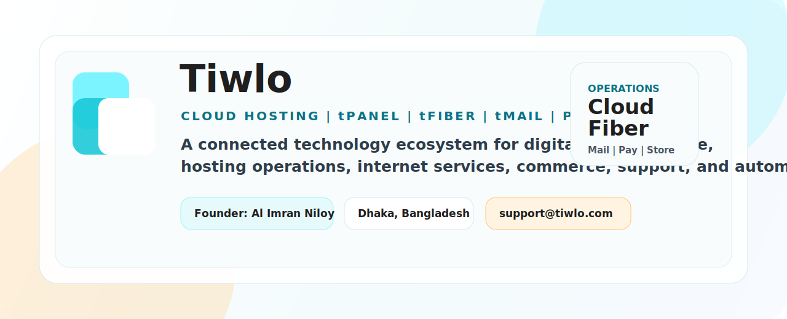

  

  

<h1 align="center">Tiwlo</h1>

  <strong>Founded by Al Imran Niloy. Built for cloud, hosting, internet infrastructure, mail, commerce, payments, AI, support, and business automation.</strong>

  <a href="https://tiwlo.com">Website</a>
  |
  <a href="https://tiwlo.com/products">Products</a>
  |
  <a href="https://tiwlo.com/documentation">Documentation</a>
  |
  <a href="https://tiwlo.com/support">Support</a>
  |
  <a href="mailto:support@tiwlo.com">Contact</a>

  
  
  
  
  

<table>
  <tr>
    <td align="center" width="33%">
      
       
      <strong>Hosting operations</strong>
       
      Accounts, packages, DNS, SSL, files, databases, runtimes, SSO, and server workflows.
    </td>
    <td align="center" width="33%">
      
       
      <strong>Internet infrastructure</strong>
       
      Subscribers, routers, packages, invoices, payment status, and ISP support context.
    </td>
    <td align="center" width="33%">
      
       
      <strong>Communication layer</strong>
       
      Mail identity, email portal workflows, account messages, automation, and business communication.
    </td>
  </tr>
</table>

<table>
  <tr>
    <td align="center" width="25%">
      
       
      <strong>Founder</strong>
       
      Al Imran Niloy
    </td>
    <td align="center" width="25%">
      <strong>Base</strong>
       
      Dhaka, Bangladesh
    </td>
    <td align="center" width="25%">
      <strong>Contact</strong>
       
      support@tiwlo.com
    </td>
    <td align="center" width="25%">
      <strong>Phone</strong>
       
      +8801410014060
    </td>
  </tr>
</table>

Tiwlo builds connected tools for teams that need practical digital infrastructure in one place. The platform brings together cloud hosting workflows, tPanel hosting operations, tFiber internet infrastructure, tMail communication, ecommerce systems, digital payment flows, domains, DNS, SSL automation, support workflows, AI tools, security controls, and business automation software.

Our goal is simple: help businesses, developers, hosting operators, ecommerce teams, ISPs, and service providers run live customer operations without scattering work across disconnected tools.

## What Tiwlo Builds

Tiwlo is not only a single app or a single hosting panel. It is a growing platform made of connected products:

<table>
  <tr>
    <td width="50%">
      <h3>Cloud Hosting</h3>
      
Cloud servers, VPS, web hosting, package limits, regions, provisioning, billing, and dashboards.

    </td>
    <td width="50%">
      <h3>tPanel</h3>
      
Hosting account operations, DNS, SSL, file manager, databases, runtime controls, SSO, and server automation.

    </td>
  </tr>
  <tr>
    <td width="50%">
      <h3>tFiber</h3>
      
Internet infrastructure workflows for broadband, subscribers, packages, router context, invoices, and support.

    </td>
    <td width="50%">
      <h3>tMail</h3>
      
Mail identity, email portal workflows, mail automation, account communication, and future communication products.

    </td>
  </tr>
  <tr>
    <td width="50%">
      <h3>Tiwlo Pay</h3>
      
Merchant verification, invoices, payment review, checkout, billing records, and digital payment operations.

    </td>
    <td width="50%">
      <h3>Cloud Store</h3>
      
Ecommerce storefronts, products, orders, customers, themes, checkout, and store admin tools.

    </td>
  </tr>
  <tr>
    <td width="50%">
      <h3>tSecurity</h3>
      
Abuse prevention, account review, verification, device signals, rate limits, and audit workflows.

    </td>
    <td width="50%">
      <h3>AI + Support</h3>
      
AI-assisted admin workflows, live chat, tickets, Discord routing, account context, identity review, and support automation.

    </td>
  </tr>
</table>

## Operating Layer

<table>
  <tr>
    <th align="left">Customer need</th>
    <th align="left">Tiwlo layer</th>
    <th align="left">Connected outcome</th>
  </tr>
  <tr>
    <td>Launch infrastructure</td>
    <td>Cloud hosting + tPanel</td>
    <td>Servers, hosting accounts, package rules, domains, DNS, SSL, and dashboards work together.</td>
  </tr>
  <tr>
    <td>Run connectivity services</td>
    <td>tFiber + ISP billing</td>
    <td>Subscribers, routers, packages, invoices, and support stay attached to the same account context.</td>
  </tr>
  <tr>
    <td>Communicate with customers</td>
    <td>tMail + support workflows</td>
    <td>Email, account messages, live chat, tickets, and operational notifications move through one product story.</td>
  </tr>
  <tr>
    <td>Sell online</td>
    <td>Cloud Store + Tiwlo Pay</td>
    <td>Storefronts, checkout, products, orders, merchant verification, invoices, and payment review stay connected.</td>
  </tr>
  <tr>
    <td>Protect the platform</td>
    <td>tSecurity + audit workflows</td>
    <td>Device checks, account review, verification, abuse prevention, and logs follow the user lifecycle.</td>
  </tr>
</table>

## Platform Vision

Modern businesses usually need many systems before they can serve customers. Tiwlo brings those systems closer together.

<table>
  <tr>
    <td align="center" width="25%">
      <strong>Infrastructure</strong>
       
      Cloud, VPS, hosting, domains, DNS, SSL, packages, and deployment workflows.
    </td>
    <td align="center" width="25%">
      <strong>Operations</strong>
       
      Customer accounts, billing records, support tickets, admin dashboards, and automation.
    </td>
    <td align="center" width="25%">
      <strong>Connectivity</strong>
       
      tFiber, ISP billing, subscribers, routers, broadband packages, and service support.
    </td>
    <td align="center" width="25%">
      <strong>Commerce</strong>
       
      Storefronts, products, checkout, Tiwlo Pay, invoices, payment review, and customers.
    </td>
  </tr>
</table>

<table>
  <tr>
    <th align="left">Instead of scattered tools</th>
    <th align="left">Tiwlo connects</th>
  </tr>
  <tr>
    <td>Hosting panel + billing portal + DNS screen</td>
    <td>tPanel, customer account, package limits, DNS, SSL, invoice, and service status.</td>
  </tr>
  <tr>
    <td>ISP spreadsheet + router notes + payment list</td>
    <td>tFiber subscriber records, routers, packages, invoices, payment state, and support.</td>
  </tr>
  <tr>
    <td>Store dashboard + payment proof + support inbox</td>
    <td>Cloud Store, Tiwlo Pay, customer records, orders, invoices, and support context.</td>
  </tr>
  <tr>
    <td>Email inbox + account notification scripts</td>
    <td>tMail, account messages, operational notifications, and communication workflows.</td>
  </tr>
  <tr>
    <td>Manual fraud checks + hidden admin notes</td>
    <td>tSecurity, verification, device signals, audit logs, and account review workflows.</td>
  </tr>
</table>

Tiwlo is designed around one connected operational account. The focus is cloud hosting, Bangladesh and global hosting operations, tPanel-powered services, tFiber infrastructure, ecommerce, payment review, DNS, SSL, support, AI-assisted operations, and security.

## Product Ecosystem

### Tiwlo Cloud

Tiwlo Cloud is the infrastructure and hosting layer for customers who need cloud services, web hosting, VPS hosting, domains, DNS, SSL, support, and billing in one place.

It is built for:

- Developers launching projects
- Businesses hosting websites
- Agencies managing client infrastructure
- Hosting providers building service packages
- Operators who need billing, support, and account state connected

Core ideas:

- Create services from clean packages
- Keep resource limits visible
- Connect billing and support to each customer
- Make hosting operations repeatable
- Keep DNS, SSL, domains, and account state in the same workflow

### tPanel

tPanel is the hosting operations experience inside the Tiwlo ecosystem. It is designed for practical server and hosting account management.

It covers workflows such as:

- Hosting account provisioning
- Package limits
- Domains and DNS
- SSL automation
- File management
- Databases
- PHP and Node.js runtime controls
- Email account context
- Account login and SSO
- Server node management
- Admin and customer dashboards

tPanel is part of the Tiwlo platform story. The goal is not to copy a generic panel, but to connect hosting controls with billing, support, verification, payments, and customer operations.

### tFiber

tFiber represents Tiwlo's internet infrastructure and ISP-focused product direction.

It is designed for broadband-style operations, including:

- Subscriber records
- Service packages
- Router context
- Billing and invoices
- Payment status
- Support workflows
- Customer service visibility
- ISP management tools

tFiber is part of Tiwlo's broader plan to connect cloud, connectivity, support, and billing inside one technology ecosystem.

### tMail

tMail is the communication and mail identity direction inside Tiwlo.

It is planned around:

- Email portal workflows
- Mail identity management
- Business communication
- Account notifications
- Mail automation
- Customer and operator communication tools

tMail helps complete the operating system around hosting, ecommerce, support, and customer communication.

### Tiwlo Pay

Tiwlo Pay focuses on payment and billing workflows.

It can support:

- Merchant verification
- Payment review
- Invoices
- Checkout flows
- Billing address collection
- Payment proof context
- Customer account balance
- Credit workflows
- Admin-controlled payment settings

Tiwlo Pay is designed to work with the wider platform instead of acting like an isolated payment screen.

### Cloud Store

Cloud Store brings ecommerce into the Tiwlo ecosystem.

It includes workflows for:

- Store creation
- Themes and storefronts
- Product management
- Orders
- Customers
- Checkout
- Currencies
- Store admin dashboards
- Customer dashboards
- Inventory and analytics direction

The goal is to let businesses launch and operate online stores while keeping payment, hosting, support, and customer accounts connected.

### tSecurity

tSecurity is Tiwlo's security and abuse-prevention layer.

It is built around:

- Signup checks
- Login protection
- Device and network signals
- Suspicious activity review
- Disabled account review
- Verification workflows
- Rate limits
- Audit logs
- Support context
- Abuse prevention

Security in Tiwlo is not only a firewall checkbox. It follows the customer lifecycle from signup to payment, service creation, login, support, and account review.

## Who Tiwlo Is For

<table>
  <tr>
    <td width="50%">
      <h3>Businesses</h3>
      
Websites, stores, domains, payments, support, communication, and automation from one practical platform.

      
Startups, local businesses, ecommerce brands, agencies, online service providers, SaaS teams.

    </td>
    <td width="50%">
      <h3>Developers</h3>
      
Deploy, manage, and connect infrastructure with fewer disconnected systems.

      
Web apps, client projects, APIs, cloud servers, domains, SSL, automation workflows.

    </td>
  </tr>
  <tr>
    <td width="50%">
      <h3>Hosting Operators</h3>
      
Sell and manage hosting packages with tPanel accounts, customer dashboards, service provisioning, payment review, support tickets, DNS, SSL, and account security.

    </td>
    <td width="50%">
      <h3>ISPs and Connectivity Teams</h3>
      
Use tFiber workflows for subscribers, routers, billing, service packages, support context, customer service, and network operations.

    </td>
  </tr>
  <tr>
    <td width="50%">
      <h3>Ecommerce Teams</h3>
      
Use Cloud Store and Tiwlo Pay to connect storefronts, checkout, products, customers, payments, invoices, and support.

    </td>
    <td width="50%">
      <h3>Support and Operations Teams</h3>
      
Keep customer accounts, payment status, verification, tickets, audit logs, service records, and admin context together.

    </td>
  </tr>
</table>

## Engineering Direction

Tiwlo is built around a few engineering principles:

<table>
  <tr>
    <td width="50%"><strong>Real workflows</strong> Build useful operational paths instead of demo-only screens.</td>
    <td width="50%"><strong>Operational clarity</strong> Prefer clear controls, status, records, and accountability over marketing noise.</td>
  </tr>
  <tr>
    <td width="50%"><strong>Connected modules</strong> Keep hosting, billing, support, security, payment, and customer context linked.</td>
    <td width="50%"><strong>Secure lifecycle</strong> Security follows signup, login, payment, service creation, support, and account review.</td>
  </tr>
  <tr>
    <td width="50%"><strong>Useful dashboards</strong> Dashboards should help teams act, not only look decorative.</td>
    <td width="50%"><strong>Admin control</strong> Expose settings, policies, package rules, and audit context clearly.</td>
  </tr>
  <tr>
    <td width="50%"><strong>Practical automation</strong> Automate repeated work without hiding important operational state.</td>
    <td width="50%"><strong>Clear product language</strong> Explain Tiwlo, tPanel, tFiber, tMail, Tiwlo Pay, and Cloud Store without vague claims.</td>
  </tr>
</table>

The platform is designed to grow module by module while keeping the customer, account, service, billing, support, and security context connected.

## Public Repositories

This GitHub organization will host public code, documentation, profile metadata, community files, tooling, and future open-source or developer-facing projects from Tiwlo.

<table>
  <tr>
    <td align="center" width="25%"><strong>Platform tools</strong> Tiwlo public utilities and automation.</td>
    <td align="center" width="25%"><strong>tPanel utilities</strong> Hosting and server workflow helpers.</td>
    <td align="center" width="25%"><strong>tFiber examples</strong> Connectivity and ISP operation references.</td>
    <td align="center" width="25%"><strong>tMail tools</strong> Communication and mail workflow utilities.</td>
  </tr>
  <tr>
    <td align="center" width="25%"><strong>API examples</strong> Developer-friendly integration samples.</td>
    <td align="center" width="25%"><strong>SDKs</strong> Future libraries and platform connectors.</td>
    <td align="center" width="25%"><strong>Deploy scripts</strong> Infrastructure and setup automation.</td>
    <td align="center" width="25%"><strong>Community files</strong> GitHub profile and repository metadata.</td>
  </tr>
</table>

Some Tiwlo systems may remain private because they contain production platform logic, infrastructure automation, security controls, or business operations code.

## Developer Resources

Useful public pages:

<table>
  <tr>
    <td><a href="https://tiwlo.com">Website</a></td>
    <td><a href="https://tiwlo.com/products">Products</a></td>
    <td><a href="https://tiwlo.com/documentation">Documentation</a></td>
    <td><a href="https://tiwlo.com/api">API</a></td>
  </tr>
  <tr>
    <td><a href="https://tiwlo.com/support">Support</a></td>
    <td><a href="https://tiwlo.com/about">About</a></td>
    <td><a href="https://tiwlo.com/bangladesh-hosting">Bangladesh hosting</a></td>
    <td><a href="https://tiwlo.com/cloud-vps-hosting">Cloud VPS hosting</a></td>
  </tr>
  <tr>
    <td><a href="https://tiwlo.com/tpanel-hosting">tPanel hosting</a></td>
    <td><a href="https://tiwlo.com/whmcs-alternative">WHMCS alternative</a></td>
    <td><a href="https://tiwlo.com/hosting-features">Hosting features</a></td>
    <td><a href="https://tiwlo.com/commerce">Commerce</a></td>
  </tr>
</table>

## Contact

For support, business questions, product inquiries, or partnership discussions:

<table>
  <tr>
    <td align="center" width="25%"><strong>Founder</strong> Al Imran Niloy</td>
    <td align="center" width="25%"><strong>Email</strong> support@tiwlo.com</td>
    <td align="center" width="25%"><strong>Phone</strong> +8801410014060</td>
    <td align="center" width="25%"><strong>Location</strong> Dhaka, Bangladesh</td>
  </tr>
</table>

Website: https://tiwlo.com

Social profiles:

- X: https://x.com/tiwlopx
- Facebook: https://www.facebook.com/tiwlopx
- Instagram: https://www.instagram.com/tiwlopx
- LinkedIn: https://www.linkedin.com/company/tiwlopx
- YouTube: https://www.youtube.com/@tiwlopx
- GitHub: https://github.com/Tiwlo
- TikTok: https://www.tiktok.com/@tiwlopx

## Organization Identity

Tiwlo is positioned as a technology ecosystem covering:

- Cloud hosting
- Web hosting
- VPS hosting
- tPanel software
- tFiber internet infrastructure
- tMail communication tools
- Digital payments
- Ecommerce services
- Domain management
- DNS automation
- SSL automation
- ISP billing
- AI tools
- Business automation
- Support workflows
- Security and account protection

The long-term direction is to build a practical operating layer for digital businesses, hosting providers, developers, ISPs, ecommerce teams, and service operators.

## Status

Tiwlo is actively evolving. Public repositories, documentation, product modules, and developer resources may change as the platform grows.

If you are looking for official product information, use https://tiwlo.com as the primary source.
